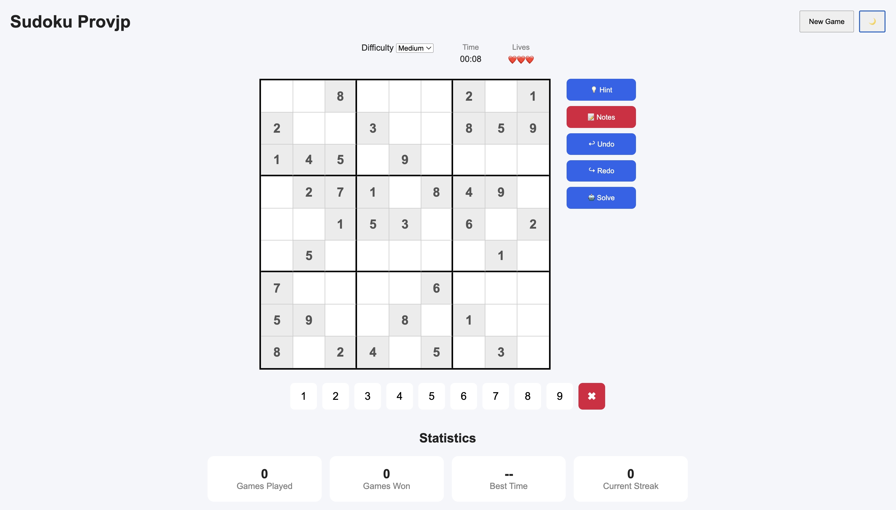
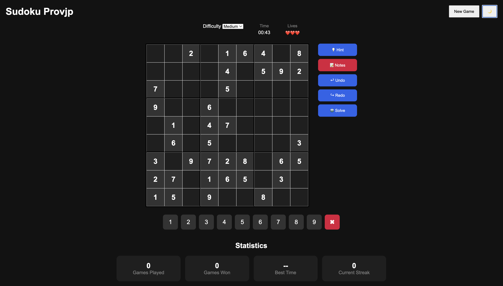

# Sudoku Provjp

Sudoku Provjp is a browser-based Sudoku game built with plain HTML, CSS, and modular JavaScript. It generates playable Sudoku puzzles in the browser, tracks the current game session, and provides common Sudoku helpers such as notes, hints, undo, redo, lives, keyboard input, and a solve action.

## Purpose

The app is designed as a focused Sudoku play experience that can run locally without a build step. It gives players a quick way to start a new puzzle, choose a difficulty, fill the board with either mouse or keyboard input, and track basic session progress.

The experience is intentionally lightweight:

- No framework or package manager is required.
- The game starts immediately when the page loads.
- Puzzle generation, validation, UI rendering, and statistics all happen in client-side JavaScript.
- The interface includes a visual 9x9 board, a number pad, helper controls, game status, and statistics.

## Features

- **Difficulty selection**: choose Easy, Medium, or Hard before starting a new game.
- **Generated puzzles**: each new game creates a fresh Sudoku puzzle with a stored solution.
- **Unique solution check**: generated puzzles are checked so the puzzle has exactly one solution.
- **Timer**: the game timer starts when a puzzle begins and stops on win, loss, or solve.
- **Lives system**: players start with three lives and lose one for each incorrect number.
- **Mistake tracking**: wrong entries count toward the win/loss summary and statistics.
- **Hints**: fill the selected editable cell with its correct value.
- **Notes mode**: toggle candidate-note entry for empty cells.
- **Undo and redo**: move backward and forward through recent board states.
- **Erase**: clear the selected editable cell and any notes in that cell.
- **Solve**: reveal the full solution and end the current game.
- **Keyboard controls**: enter numbers with `1` through `9`, erase with `Backspace` or `Delete`, and move selection with arrow keys.
- **Dark mode**: toggle between light and dark visual themes.
- **Win modal**: shows completion time and mistake count, then launches confetti.
- **Loss modal**: appears after the player runs out of lives.
- **Session statistics**: tracks games played, games won, best time, current streak, longest streak, and total mistakes during the browser session.

## Demo

This project is live at https://sudoku-provjp.netlify.app/

Screenshots:



 


## Technical Design

Sudoku Provjp is organized as a small client-side application. `index.html` defines the app structure, `style.css` controls presentation, and the JavaScript files under `js/` split game behavior into focused modules.

### Application flow

1. `index.html` loads `js/game.js` as an ES module.
2. `game.js` calls `startNewGame()` when the module loads.
3. A new puzzle is generated by `generateSudoku()` in `js/generator.js`.
4. The board, original puzzle, solution, notes grid, timer, lives, mistake count, and history stacks are initialized.
5. `renderBoard()` in `js/ui.js` draws the 9x9 board from the current state.
6. Player input updates game state through `game.js`.
7. UI helper functions update cells, lives, timer, modals, and statistics display.
8. Win or loss conditions stop the timer, update statistics, and show the appropriate modal.

### Game state

The main game state lives in `js/game.js`:

- `board`: the current playable board, with `0` representing empty cells.
- `originalBoard`: the fixed givens from the generated puzzle.
- `solution`: the completed solution board.
- `notesBoard`: a 9x9 grid of note arrays for candidate numbers.
- `selectedRow` and `selectedCol`: the currently selected cell.
- `lives`: starts at `3` and decreases after incorrect entries.
- `mistakes`: counts incorrect number placements.
- `timer`: elapsed seconds for the current puzzle.
- `gameFinished`: prevents further input after win, loss, or solve.
- `noteMode`: switches between number entry and candidate-note entry.
- `actionHistory` and `redoHistory`: snapshots used for undo and redo.

History snapshots include the board, notes board, selected cell, lives, and mistake count. The undo history is capped at 50 entries.

### Puzzle generation

Puzzle generation is handled by `js/generator.js`.

The generator:

1. Creates an empty 9x9 board.
2. Fills it with a complete valid Sudoku solution using randomized backtracking.
3. Clones the completed solution into a puzzle board.
4. Removes a difficulty-based number of cells:
   - Easy: 35 cells
   - Medium: 45 cells
   - Hard: 55 cells
5. After each removal, checks the puzzle with `countSolutions()` from `js/solve.js`.
6. Keeps the removal only if the puzzle still has exactly one solution.

This means each generated puzzle is playable and has a single valid answer.

### Solving and validation

`js/solve.js` contains the shared Sudoku logic:

- `isValid(board, row, col, num)` checks whether a number can be placed in a row, column, and 3x3 box.
- `findEmpty(board)` returns the next empty cell.
- `solve(board)` solves a board in place using backtracking.
- `countSolutions(board)` counts solutions and stops once more than one solution is found.
- `cloneBoard(board)` creates a shallow clone of each board row.

The active game does not call `solve()` directly for the **Solve** button. Instead, `game.js` stores the generated solution and copies it into the current board when the player clicks **Solve**.

### UI rendering

`js/ui.js` owns DOM rendering and visual updates:

- `renderBoard()` creates the 81 board inputs and applies cell classes.
- Fixed cells are disabled and styled differently from editable cells.
- 3x3 box borders are applied with extra CSS classes.
- Selected, wrong, highlighted, fixed, and note states are represented with CSS classes.
- Timer, lives, stats, win modal, loss modal, dark mode, and confetti are updated through UI helper functions.

The board is rendered from state rather than hard-coded in the HTML. This keeps the markup small and lets the game redraw after new games, undo, redo, and solve.

### Statistics and storage

`js/stats.js` stores statistics in `sessionStorage` under the `sudoku-stats` key. Because it uses `sessionStorage`, stats last for the current browser tab session and reset when that session ends.

Tracked statistics include:

- `gamesPlayed`
- `gamesWon`
- `bestTime`
- `currentStreak`
- `longestStreak`
- `totalMistakes`

The UI currently displays games played, games won, best time, and current streak.

`js/storage.js` also provides utility functions for future persistence features:

- Saving and loading a game with `localStorage`
- Clearing a saved game
- Saving and loading settings
- Saving and loading replay data

These storage helpers are present in the codebase but are not currently wired into the active game flow.

### Styling

`style.css` defines the full visual layout:

- Global reset and base typography
- Header layout
- Difficulty, timer, and lives panel
- Centered game board and side controls
- 9x9 Sudoku grid with heavier 3x3 borders
- Cell states for selected, fixed, wrong, highlighted, and note values
- Number pad
- Statistics cards
- Win/loss modal layout
- Dark mode variants

## File Structure

```text
.
├── index.html
├── style.css
└── js
    ├── game.js
    ├── generator.js
    ├── solve.js
    ├── stats.js
    ├── storage.js
    └── ui.js
```

### Key files

- `index.html`: app shell, controls, board mount point, statistics, modals, and script loading.
- `style.css`: all layout, board, modal, control, and dark mode styles.
- `js/game.js`: central game controller and event wiring.
- `js/generator.js`: solved board generation and puzzle creation.
- `js/solve.js`: Sudoku validation, solving, and solution counting utilities.
- `js/ui.js`: DOM rendering and visual update helpers.
- `js/stats.js`: session statistics and time formatting.
- `js/storage.js`: local persistence helpers reserved for future save/settings/replay features.

## Development Notes

- The app uses native ES modules, so it should be served through a local server instead of opened directly as a `file://` URL.
- The confetti effect is loaded from jsDelivr through `canvas-confetti`.
- No build step, bundler, transpiler, or package installation is required.
- The current statistics are session-based, not permanent.
- Dark mode changes the current page theme but is not saved across reloads.
- The save/settings/replay utilities in `js/storage.js` are available but not connected to the UI.

## Future Improvements

- Persist dark mode and preferred difficulty with `js/storage.js`.
- Add save/resume support for unfinished games.
- Add a reset statistics button.
- Display win rate, average mistakes, and longest streak in the statistics panel.
- Add mobile-responsive sizing for smaller screens.
- Add puzzle sharing or replay export.
- Add accessibility improvements such as ARIA labels and clearer focus states.
- Add automated tests for puzzle generation, solution uniqueness, and game-state transitions.
